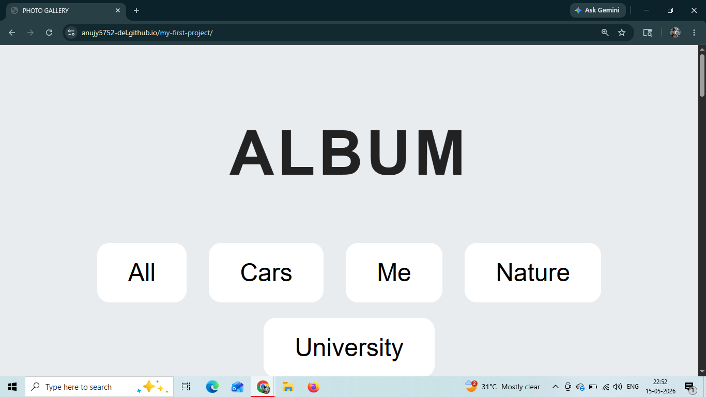
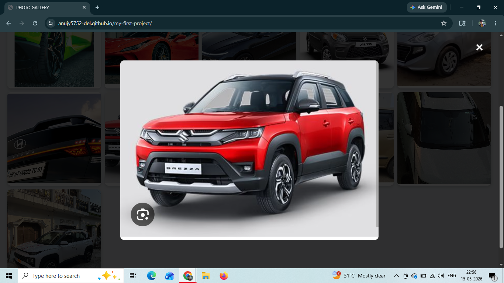

# 📸 Photo Gallery

A responsive and visually appealing **Photo Gallery** built using **HTML, CSS, and JavaScript**. This project showcases images in a clean grid layout with an interactive image preview, providing a simple and engaging user experience.

## 🌐 Live Demo

🔗 **View the Project:**
https://anujy5752-del.github.io/Photo-Gallery/

---

## ✨ Features

* 📷 Responsive photo gallery layout
* 🖱️ Click on images to view them in a larger preview
* 🎨 Clean and modern user interface
* ⚡ Fast and lightweight
* 📱 Responsive design for different screen sizes
* 💻 Built using pure HTML, CSS, and JavaScript

---

## 🛠️ Technologies Used

* HTML5
* CSS3
* JavaScript (ES6)

---

## 📂 Project Structure

```text
Photo-Gallery/
│── index.html
│── style.css
│── script.js
│── home-page.png
│── gallery-view.png
│── image-preview.png
└── README.md
```

---

## 📸 Screenshots

### 🏠 Home Page



### 🖼️ Gallery View


### 🔍 Image Preview



---

## 🚀 Getting Started

1. Clone the repository:

```bash
git clone https://github.com/anujy5752-del/Photo-Gallery.git
```

2. Open the project folder.

3. Double-click **index.html** or open it in your preferred web browser.

---

## 📚 What I Learned

* Creating responsive layouts using CSS
* Working with JavaScript DOM manipulation
* Handling user interactions with event listeners
* Organizing a front-end project
* Building a clean and user-friendly interface

---

## 🔮 Future Improvements

* 🌙 Dark Mode
* 🏷️ Category filters
* ❤️ Favorite images feature
* ⬅️➡️ Next/Previous image navigation
* 🔍 Search functionality
* ✨ More animations and transitions

---

## 👨‍💻 Author

**Anuj Kumar Yadav**

GitHub: https://github.com/anujy5752-del

---

## ⭐ Support

If you found this project useful or liked the design, consider giving it a **⭐ Star** on GitHub. It helps motivate me to build more projects and continue learning!
